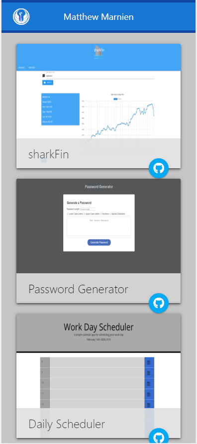
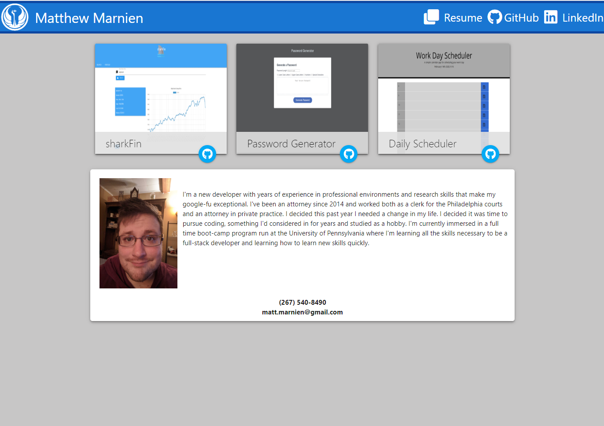

# mattmarnien.github.io
My Portfolio Page:

This is my updated portfolio and bio page all in one page. The design is simple, responsive, and has room to add more projects and functionality over time. 
The page also now links to my gitHub profile, linkedin profile, and my resume.

The deisgn makes use of responsive elements and functions on both desktop and mobile devices while maintaining the integrity of the elements.

mattmarnien.github.io

Mobile Screenshots

Desktop Screenshots

